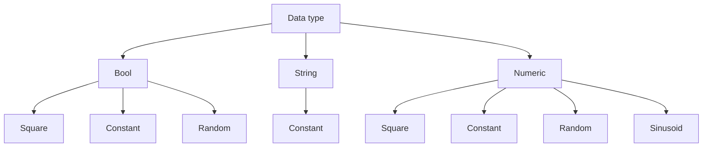

# Universal Emulator

**Возможности:**

В эмуляторе доступны следующие типы данных и модуляции их значений:

**NC mode:**
Чекбокс Enable NC mode создаёт теги WorkByProg (bool), ProgramName (string), SubProgramName (string), Frame Text (string), необходимые для проверки функционала связанного с УП. При запуске эмулятора будет выполняться сценарий выполнения УП и подпрограмм:

- WorkByProg = 1 и выполнение MainProg.txt. Длительность выполнения зависит от количества строк в программе - 1 строка = 1 секунда.
- WorkByProg = 1 и выполнение  SubProg1.txt. Длительность выполнения зависит от количества строк в программе - 1 строка = 1 секунда.
- WorkByProg = 1 и выполнение  SubProg2.txt. Длительность выполнения зависит от количества строк в программе - 1 строка = 1 секунда.
- WorkByProg = 1 и выполнение  SubProg3.txt. Длительность выполнения зависит от количества строк в программе - 1 строка = 1 секунда.
- 20 секунд - WorkByProg = 0

----

Один из вариантов настройки для корректной работы сценария:

-   WorkByProg == 0 настраиваем на начало выполнения УП
-   WorkByProg == 1 настраиваем на окончание выполнения УП
-   ProgramName настраиваем на спецпараметр "Имя УП"
-   SubProgramName настраиваем на спецпараметр "Имя подпрограммы"
-   FrameNumber настраиваем на спецпараметр "Номер кадра" (необходим для проверки атрибутов УП)
-   опционально - Frame Text настраиваем на спецпараметр "Текст кадра УП"
----
**Работа с конфигами и пресетами:**

По нажатию кнопки Save Configuration создается xml-файл для возможности передачи его и быстрого конфигурирования тегов. По кнопке Load Configuration - загружаем этот файл и получаем ранее сконфигурированные теги.

По нажатию кнопки Generate Universal Preset создается xml-файл пресета Universal, для загрузки в ServerUI\Presets\Universal и дальнейшей настройки в ServerUI.
## Важно!!!
**Теги сценария выполнения УП (WorkByProg, ProgramName, SubProgramName, FrameText, FrameNumber) не будут полноценно подхвачены из конфига!!! При необходимости их нужно добавлять через установку чекбокса "Enable NC mode"**
----
**Работа с эмулятором:**

Тут расписывать особо нечего - создали теги, по нажатию соответствующей кнопки создали шаблон Universal, подкинули его в ServerUI\Presets\Universal, настроили состояния и измеряемые, нажали Start. В случае успешного подключения к АИС Диспетчер в поле статуса подключения будет надпись "Connected" на зеленом фоне. В случае неудачи - "Not connected" на красном фоне. Запросы  GetIsMonitoringBlocked посылаются с каждым запросом на отправку данных. В таблице с тегами в поле Current Value будет отражено текущее значение каждого из тегов. В этом же поле можно вручную менять значения тегов.

----
**Список изменений**

- 2022.07.01	Версия 1.0.0.0	Первичная версия
- 2022.07.05	Версия 1.0.0.1	Изменён механизм NC mode: теперь длительность выполнения зависит от количества строк в файле УП. 1 строка = 1 секунда.
- 2022.07.07	Версия 1.0.0.2	Корректировка старта отправки УП